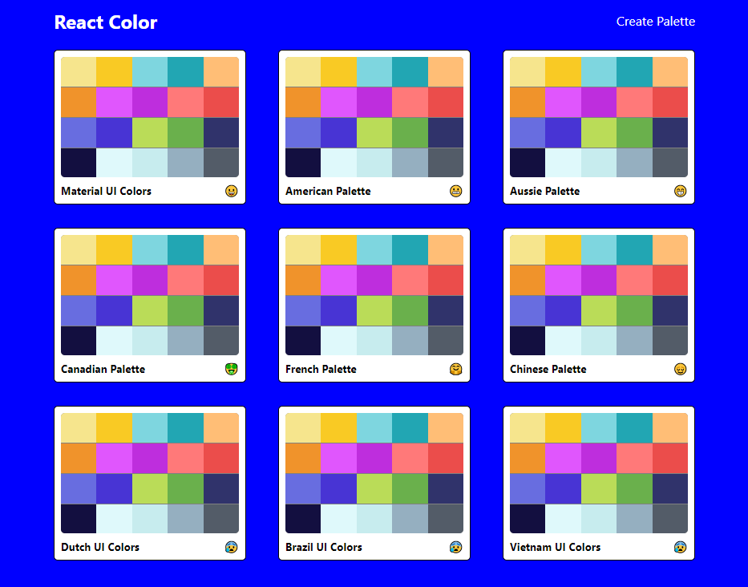

# Color Palette

A page where you can pick a color palette you like, customize it and save it. You can even create one on your own!

## Table of contents

- [Overview](#overview)
  - [The challenge](#the-challenge)
  - [Screenshot](#screenshot)
- [My process](#my-process)
  - [Built with](#built-with)
  - [What I learned](#what-i-learned)
- [Author](#author)

## Overview

### The challenge

Users should be able to:

- Click on to copy the color HEX, RGB or RGBA code.
- Modify the brightness of each color
- Create a brand new color of their own, drag and drop any color they like and name them.

### Screenshot



## My process

### Built with

- Semantic HTML5 markup
- CSS custom properties
- Flexbox
- Javascript
- REACTJS

### What I learned

```js
for (let i in scale) {
  newPalette.colors[levels[i]].push({
    name: `${color.name} ${levels[i]}`,
    id: color.name.toLowerCase().replace(/ /g, "-"),
    hex: scale[i],
    rgb: chroma(scale[i]).css(),
    rgba: chroma(scale[i]).css().replace("rgb", "rgba").replace(")", ",1.0)"),
  });
}
```

## Author

- Frontend Mentor - [@manhtran1611](https://www.frontendmentor.io/profile/manhtran1611)
- Facebook - [@manhtranduc1611](https://www.facebook.com/manhtranduc1611)
